# Airbnb clone backend (Python)

## library & framework

### poetry


poetry 를 통한 쟝고 설치 (현재 프로젝트의 가상환경에 django 설치)
```
poetry add django
```

설치 후 poetry.toml
```toml
[tool.poetry]
name = "airbnb-clone-backend"
version = "0.1.0"
description = ""
authors = ["hwisaac <54179672+hwisaac@users.noreply.github.com>"]
license = "MIT"
readme = "README.md"
packages = [{include = "airbnb_clone_backend"}]

[tool.poetry.dependencies]
python = "^3.11"
django = "^4.2.4"


[build-system]
requires = ["poetry-core"]
build-backend = "poetry.core.masonry.api"
```

poetry 로 만든 bubble(가상환경) 에 들어가기
```
poetry shell
```

>`poetry shell` 명령어는 Poetry가 관리하는 가상 환경에 쉘 접근을 제공하는 명령어입니다. Python에서는 여러 프로젝트에서 서로 다른 패키지 버전을 사용할 수 있도록 가상 환경이라는 개념을 사용합니다. 이를 통해 각 프로젝트마다 독립적인 환경을 만들어 사용할 수 있습니다. `poetry shell` 명령을 사용하면, 해당 프로젝트에 대한 가상 환경이 생성되거나 이미 존재하는 경우 해당 환경에 접속할 수 있습니다. 이 쉘 안에서 실행되는 모든 Python 프로그램은 가상 환경의 패키지를 사용하게 됩니다.

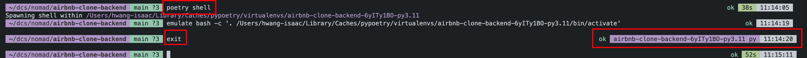

## django

### django-admin
- check
- compilemessages
- createcachetable
- dbshell
- diffsettings
- dumpdata
- flush
- inspectdb
- loaddata
- makemessages
- makemigrations
- migrate
- optimizemigration
- runserver
- sendtestemail
- shell
- showmigrations
- sqlflush
- sqlmigrate
- sqlsequencereset
- squashmigrations
- startapp
- **startproject**
- test
- testserver


현재 폴더에 프로젝트를 만든다.
```
django-admin startproject config .
```

manage.py
```py
#!/usr/bin/env python
"""Django's command-line utility for administrative tasks."""
import os
import sys


def main():
    """Run administrative tasks."""
    os.environ.setdefault('DJANGO_SETTINGS_MODULE', 'config.settings')
    try:
        from django.core.management import execute_from_command_line
    except ImportError as exc:
        raise ImportError(
            "Couldn't import Django. Are you sure it's installed and "
            "available on your PYTHONPATH environment variable? Did you "
            "forget to activate a virtual environment?"
        ) from exc
    execute_from_command_line(sys.argv)


if __name__ == '__main__':
    main()

```

> 이 코드는 Django 프로젝트를 실행하기 위한 표준 명령어 실행 스크립트입니다. 이 스크립트는 명령 행에서 Django 관리 명령어들을 실행하는 데 사용됩니다. 이를테면, `python manage.py runserver`와 같은 명령어가 이 스크립트를 통해 실행됩니다.

아래는 이 코드의 주요 부분에 대한 설명입니다:

- `#!/usr/bin/env python`: 이 부분은 이 스크립트가 Python 인터프리터를 사용해 실행되어야 함을 나타내는 shebang 라인입니다. Unix와 Unix-like 시스템에서 이 스크립트는 실행 가능한 파일로 설정되어 직접 실행될 수 있습니다.
  
- `import os`, `import sys`: `os`와 `sys` 모듈을 임포트합니다. 이 모듈들은 파이썬의 표준 라이브러리로, 각각 운영 체제와 파이썬 런타임과 관련된 기능을 제공합니다.

- `def main():`: `main` 함수를 정의합니다. 이 함수는 스크립트가 실행될 때 호출되는 메인 진입점입니다.

- `os.environ.setdefault('DJANGO_SETTINGS_MODULE', 'config.settings')`: 환경 변수 `DJANGO_SETTINGS_MODULE`을 설정하며, 이 환경 변수는 Django 설정 모듈의 이름을 가리킵니다. `setdefault` 메서드는 환경 변수가 이미 설정되어 있지 않을 경우에만 값을 설정합니다.

- `from django.core.management import execute_from_command_line`: Django의 관리 명령어 실행 함수 `execute_from_command_line`을 임포트합니다.

- `try...except ImportError...`: Django 모듈을 임포트하는 데 실패하면 오류 메시지를 출력하고 스크립트를 종료합니다. 이는 Django가 설치되어 있지 않거나 파이썬 경로에 없거나, 가상 환경이 활성화되지 않았을 경우에 발생합니다.

- `execute_from_command_line(sys.argv)`: `execute_from_command_line` 함수를 호출하여 Django 관리 명령어를 실행합니다. 이 함수는 명령 행 인자들을 파라미터로 받습니다.

- `if __name__ == '__main__':`: 이 스크립트가 직접 실행되면 `main` 함수를 호출합니다. 이 스크립트가 다른 스크립트에 의해 임포트되는 경우에는 `main` 함수를 호출하지 않습니다.

> (참고) 실제 서버에 배포할 때는 서버를 실행할 때 manage.py 말고 다른 걸 사용할 것입니다.


실행하기(터미널에 다음을 입력하면 `db.sqlite3` 파일이 생성됨과 동시에 서버가 작동한다.)
```
python manage.py runserver
``` 

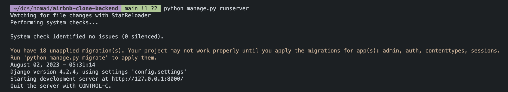
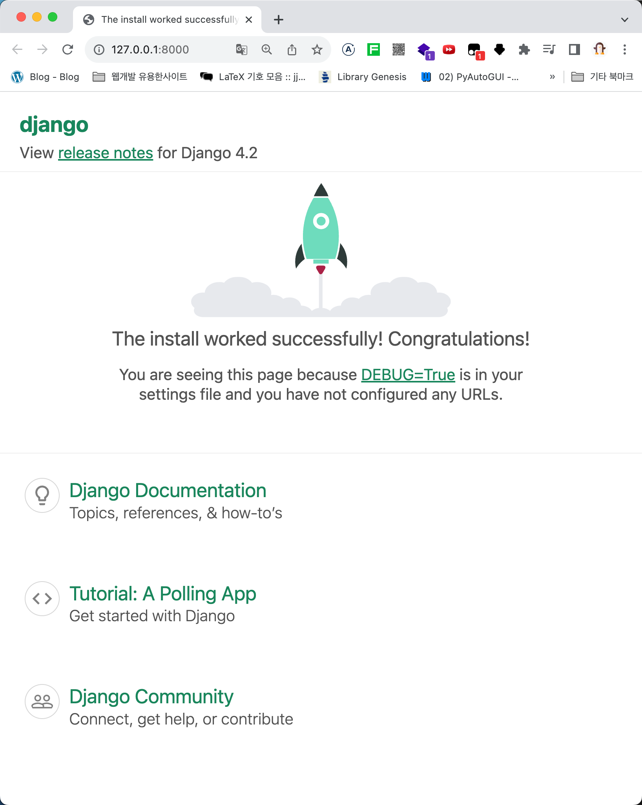


> Error : <br />`You have 18 unapplied migration(s). Your project may not work properly until you apply the migrations for app(s): admin, auth, contenttypes, sessions.Run 'python manage.py migrate' to apply them.`

이 메시지는 Django에서 나오는 경고 메시지로, 데이터베이스 스키마 변경에 대한 마이그레이션(migration)을 아직 적용하지 않았음을 나타냅니다. Django에서는 데이터베이스 스키마 변경을 관리하기 위해 마이그레이션 시스템을 사용합니다. 

여기서 "18 unapplied migration(s)"라는 메시지는 현재 18개의 마이그레이션 파일이 적용되지 않았음을 의미합니다(DB state를 변경시키는 파일이 18개 있음). 'admin', 'auth', 'contenttypes', 'sessions' 등의 애플리케이션에서 변경된 데이터베이스 스키마에 대한 마이그레이션 파일이 있지만 아직 데이터베이스에 적용되지 않았습니다.

이런 상태에서는 프로젝트가 제대로 동작하지 않을 수 있습니다. 왜냐하면, Django 애플리케이션은 마이그레이션 파일에 기술된 대로 데이터베이스 스키마를 기대하기 때문입니다. 이러한 변경사항을 데이터베이스에 적용하지 않으면, 애플리케이션의 모델과 실제 데이터베이스 스키마가 일치하지 않아 오류가 발생할 수 있습니다.

따라서 이 메시지는 당신이 **`python manage.py migrate` 명령을 실행해서 마이그레이션을 적용하라**는 것을 알리는 것입니다. 이 명령은 모든 마이그레이션 파일을 순서대로 적용하여, Django 애플리케이션의 모델과 데이터베이스 스키마를 동기화합니다.

#### `python manage.py migrate` 명령을 실행


이제 `db.sqlite3` 파일을 살펴보면:

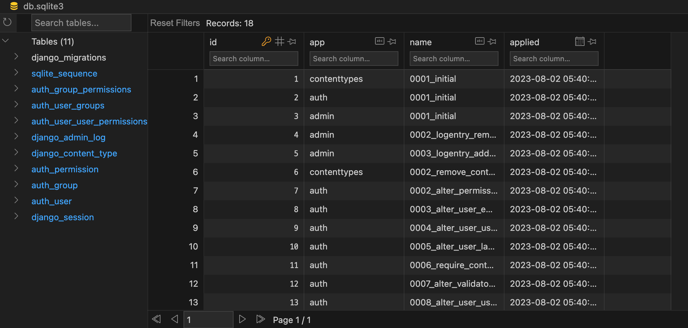


Recap
- django 는 세션,패스워드 등 모든 유저 데이터를 저장하는 곳으로 db 를 사용합니다.
- django 는 `db.sqlite3` 파일에서 `auth_user` 라는 테이블을 찾습니다.


#### `python manage.py createsuperuser` 명령을 실행 (poetry 가상환경에 있어야 한다.)

`python manage.py createsuperuser`는 Django의 명령어로, 관리자 계정을 생성하는 데 사용됩니다. Django에서는 관리자 계정을 통해 관리자 사이트를 사용할 수 있습니다.

관리자 사이트는 Django의 강력한 기능 중 하나로, 데이터베이스에 저장된 데이터를 조회, 생성, 수정, 삭제하는 인터페이스를 제공합니다. 예를 들어, 사용자 계정, 그룹, 애플리케이션의 모델 등의 데이터를 관리할 수 있습니다.

`createsuperuser` 명령을 실행하면, 먼저 사용자 이름을 입력하라는 프롬프트가 나타납니다. 그 다음에 이메일 주소와 비밀번호를 입력하라는 프롬프트가 나타납니다. 이 정보를 입력하면 관리자 계정이 생성되고, 이 계정으로 관리자 사이트에 로그인할 수 있습니다.

이 명령은 일반적으로 개발 환경에서 사용되며, 운영 환경에서는 보안상의 이유로 다른 방법을 사용해 관리자 계정을 생성하는 것이 일반적입니다.

터미널:
```
Username (leave blank to use 'hwang-isaac'): hwisaac
Email address: hwisaac0@gmail.com
Password: 123123
Password (again): 
This password is too short. It must contain at least 8 characters.
This password is too common.
This password is entirely numeric.
Bypass password validation and create user anyway? [y/N]: y
Superuser created successfully.
```

이제 `/admin` 에서 로그인 하면 다음 화면을 볼 수 있습니다:
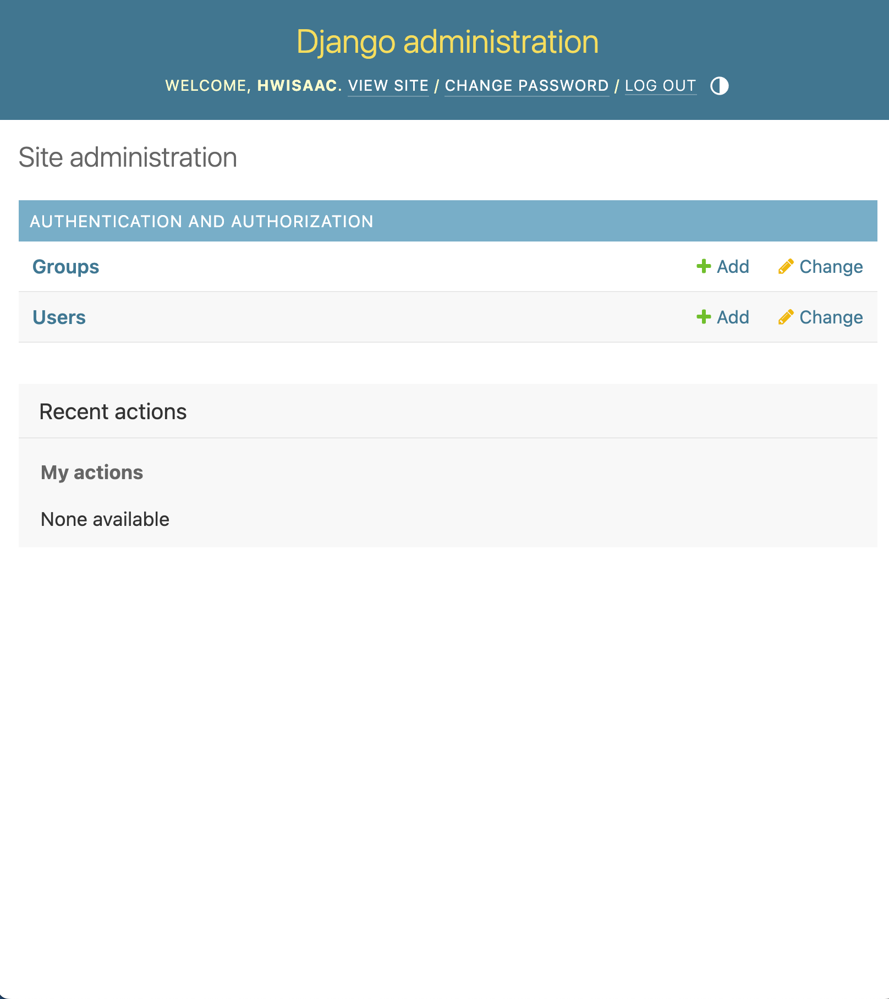

#### `python manage.py startapp houses` 명령 실행(houses 는 앱의 이름이 될 것입니다)

`houses/` 폴더가 생성됩니다.
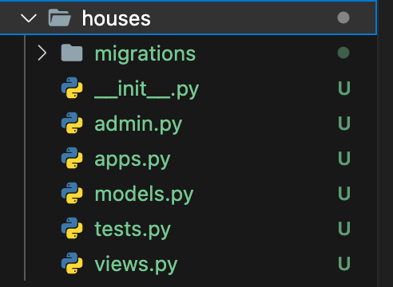

`models.py` 에 모델*을 정의하고 admin.py 에 모델을 등록해야 합니다.

> 모델(*)은 어플리케이션에서 데이터의 모양을 describe 합니다.

> https://docs.djangoproject.com/ko/4.2/topics/db/models/

Django에서의 "Model"은 데이터베이스와의 상호작용을 관리하는 Python 클래스를 의미합니다. Django는 데이터베이스의 스키마를 정의하고 데이터를 저장, 수정, 검색하는 데 사용되는 ORM(Object-Relational Mapping) 기술을 제공합니다. 이 ORM은 SQL 쿼리를 직접 작성하지 않고도 데이터베이스와 상호작용할 수 있도록 도와줍니다.

Model 클래스는 Django 애플리케이션의 models.py 파일에 정의됩니다. 각 Model 클래스는 데이터베이스 테이블의 구조를 정의하고, 데이터베이스와 상호작용하는데 필요한 메서드와 속성을 가지고 있습니다.

Model 클래스의 주요 특징:

1. 클래스 변수: Model 클래스는 데이터베이스 테이블의 각 열을 클래스 변수로 표현합니다. 이러한 변수는 데이터베이스 필드와 매핑되어 데이터의 타입과 제약 조건을 정의합니다.

2. 메서드: Model 클래스는 데이터베이스와 상호작용하기 위한 다양한 메서드들을 제공합니다. 예를 들면, 객체 생성, 수정, 삭제, 데이터 검색 등의 작업을 수행하는 메서드들이 있습니다.

3. 관계 정의: Model 클래스를 사용하여 데이터베이스 테이블 간의 관계를 정의할 수 있습니다. 예를 들어, ForeignKey, OneToOneField, ManyToManyField 등을 사용하여 다른 테이블과의 관계를 설정할 수 있습니다.

Model 클래스의 정의 예시:

```python
from django.db import models

class Author(models.Model):
    name = models.CharField(max_length=100)
    email = models.EmailField()

class Book(models.Model):
    title = models.CharField(max_length=200)
    publication_date = models.DateField()
    author = models.ForeignKey(Author, on_delete=models.CASCADE)
```

위의 예시에서 `Author`와 `Book`은 두 개의 Django Model 클래스입니다. `Author` 클래스는 "name"과 "email" 필드를 갖고 있으며, `Book` 클래스는 "title", "publication_date", 그리고 "author" 필드를 갖고 있습니다. `author` 필드는 `Author` 클래스와의 관계를 나타내기 위해 ForeignKey를 사용하여 정의되었습니다.

Django의 Model을 사용하면 데이터베이스와의 상호작용을 추상화하고 편리하게 관리할 수 있습니다. Model 클래스를 사용하여 데이터베이스의 스키마를 정의하면, Django는 데이터베이스에 대한 복잡한 처리를 대신 처리해주므로 개발자는 데이터베이스와 직접적인 상호작용에 대해 걱정하지 않고도 애플리케이션을 개발할 수 있습니다.

<hr />

db 는 해당 모델에 대해 전혀 모르는 상황입니다. 

django 에게 파일의 존재를 알리기
`config/settings.py`
```py
INSTALLED_APPS = [
    'django.contrib.admin',
    'django.contrib.auth',
    'django.contrib.contenttypes',
    'django.contrib.sessions',
    'django.contrib.messages',
    'django.contrib.staticfiles',
    'houses.apps.HousesConfig',
]
```


모델이 완성되었으면, `admin.py`에 `import` 해준다:
```py
from django.contrib import admin
from .models import House


@admin.register(House) # 이 HouseAdmin class 가 House 모델을 통제하게 한다
class HouseAdmin(admin.ModelAdmin):
    pass
```

<hr />

`migration` 을 통해 db의 모양을 변경합시다.

#### `python manage.py makemigrations` 

model 에 관한 정보를 토대로 `houses/migrations` 폴더에 파일(예:`0001_initial.py` )을 생성합니다.
#### `python manage.py migrate` : 마이그레이션을 적용합니다.

이제 `db` 가 `models.py` 가 연동되었습니다.

(model을 변경ㅏ면 makemigrations 와 migrate 를 다 해줘야 적용됩니다.)

## model

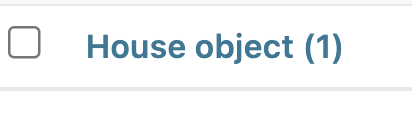

> `__str__` 메서드를 재정의하면 House object 와 같은 이름을 변경할 수 있습니다.

```py
class House(models.Model):

    """Model Definition for Houses"""

    name = models.CharField(max_length=140)
    price_per_night = models.PositiveIntegerField()
    description = models.TextField()
    address = models.CharField(max_length=140)
    # https://docs.djangoproject.com/en/4.2/ref/models/fields/#default
    pats_allowed=models.BooleanField(default=True)
    def __str__(self):
        return self.name
```


## field 
필드 옵션 문서
https://docs.djangoproject.com/en/4.2/ref/models/fields/

> `admin.py` 파일을 수정합시다.

admin.py
```py
# 수정전
from django.contrib import admin
from .models import House

@admin.register(House)
class HouseAdmin(admin.ModelAdmin):
    pass
```

`list`나 `tuple` 속성을 전달해야 합니다. (`string` 은 ❌)

### list_display 속성

> admin 패널에 보이고 싶은 column 들의 list 를 적어줍니다. (실제로 존재하는 이름들이어야 함)

```py
@admin.register(House)
class HouseAdmin(admin.ModelAdmin):
    list_display = [
        "name",
        "price_per_night",
        "address",
        "pets_allowed"
    ]
```


### list_filter 속성

> 어떤 column 을 기준으로 필터링 할 지를 적으면 됩니다.

```py
list_filter = [
    "price_per_night",
    "pets_allowed"
]
```
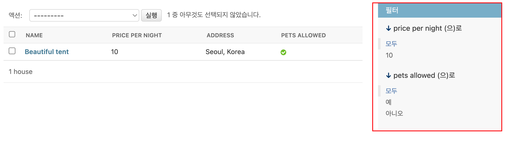


### search_fields 속성

> 어떤 column 에 대해 검색할지 정합니다.

```py
search_fields = [
    "address" # address__startswith 라고 하면 시작하는 단어로 검색합니다
]
```


## User 관리

django 는 기본적으로 관리자패널(http://127.0.0.1:8000/admin/)과 User 에 대한 것들을 제공해줍니다.(http://127.0.0.1:8000/admin/auth/user/)
이 것들을 어떻게 사용해야 할까요?
커스터마이징하려면 어떻게 해야 할까요?

**옵션1**
- django 가 제공하는 user 를 이용해서 profile 모델을 만들고, Profile은 user에 추가하고 싶은 커스텀들을 가지도록 만듭니다.

**옵션2**
- [user 모델을 아예 새로 custom 한다](https://docs.djangoproject.com/en/4.2/topics/auth/customizing/#substituting-a-custom-user-model)

> 기본으로 제공되는 user 모델만으로 충분하더라도 custom model 을 만들어서 대체하는것을 추천합니다.


## vscode 가 django 를 찾지 못하는 경우
> vscode 에서 django 에 노란색 밑줄이 그어진 현상을 해결하는 방법

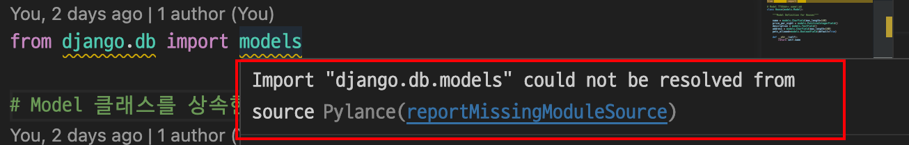

문제원인
django 는 가상환경에 설치되어 있습니다. 그러나, pylance 는 컴퓨터에서 django 를 찾기 때문에 찾을 수가 없습니다.

문제해결
poetry 의 가상환경의


## python 포매터 추천: Formatter black

## users app 을 만들자
> Django 의 user 를 상속받는 우리만의 user


```
poetry shell
```

```
python manage.py runserver
```

users 앱 생성하기
```
python manage.py startapp users
```

`INSTALLED_APPS` 에 `users` 앱 추가하기
```py
INSTALLED_APPS = [
    ...,
    "users.apps.UsersConfig",
]
```

생성한 apps 폴더의 `models.py` 에서 모델 및 필드 정의하기 (`__str__`, F oreignKey 등)
생성한 apps 폴더의 `admin.py` 에서 관리자 패널에 대해 정의하기
`python manage.py makemigrations` , `python manage.py migrate` 키워드로 동기화시키기


### user 를 상속받아서 만들기
```py
from django.db import models
from django.contrib.auth.models import AbstractUser

# 새로운 user 모델을 만들 경우
"""
class User(models.Model):
    pass
"""

# 상속 받아서 user 모델을 만들 경우
class User(AbstractUser):
    pass
```


#### settings.py 설정

> django 에 user model 을 사용하겠다고 알려줘야 합니다.

`config/settings.py` 에 다음을 추가:

```py
# Auth
AUTH_USER_MODEL = "users.User"
```

`INSTALLED_APPS` 배열에도 `'users.apps.UsersConfig'` 추가

```py
# Application definition
CUSTOM_APPS = [
    "hoses.apps.HousesConfig",
    
]
SYSTEM_APPS = [
    'django.contrib.admin',
    'django.contrib.auth',
    'django.contrib.contenttypes',
    'django.contrib.sessions',
    'django.contrib.messages',
    'django.contrib.staticfiles',
]

INSTALLED_APPS = CUSTOM_APPS + SYSTEM_APPS

```

#### 만약 프로젝트 중간에 user 를 시작한 경우

프로젝트 도중 기존에 user 모델을 사용해서 사용자를 만들어서 사용하고 있다면, 새로운 user 모델을 만들수가 없습니다.

이런 경우, 우선 서버를 종료하고
1. `db.sqlite3` 파일을 삭제해서 db의 모든 유저를 제거하고, migrations 폴더의 migration 들을 (앞에 숫자붙은 파일들) 도 삭제합니다.
2. `python manage.py makemigrations` 실행
3. `python manage.py migrate` 실행
4. `python manage.py runserver` 서버를 재시작합니다.

`python manage.py createsuperuser` 관리자 계정도 생성

> Note : 만약에 다음과 같이 default 값을 전해주지 않은 `is_host` 필드가 있는 채로 migrate 를 시도한다면 에러가 발생합니다

```py
class User(AbstractUser):
    first_name = models.CharField(max_length=150, editable=False)
    last_name = models.CharField(max_length=150, editable=False)
    name = models.CharField(max_length=150, editable=False)
    is_host = models.BooleanField()
```

```
It is impossible to add a non-nullable field 'is_host' to user without specifying a default. This is because the database needs something to populate existing rows.
Please select a fix:
 1) Provide a one-off default now (will be set on all existing rows with a null value for this column)
 2) Quit and manually define a default value in models.py.
Select an option: 
```
- non-nullable 필드인 `is_host` 필드에 default value 없이 모델에 추가하는 것은 불가능합니다.(데이터베이스는 기존 rows 에 입력 시킬 데이터가 필요하기 때문. 이미 생성해둔 슈퍼유저가 `is_host=null` 인 데이터를 가지기 때문 )
    1. 해결1: 지금 1회성 디폴트값을 제공한다
    2. 해결2: 직접 models.py 파일에 default value 를 정의해준다.
    3. 해결3: nullable 이도록 `is_host = models.BooleanField(null=True)` 로 수정합니다.

<hr />


# ORM
## queries
https://docs.djangoproject.com/en/4.2/topics/db/queries/

> 지금까지 model 을 생성하는 것에 배웠다면 이젠 소통하는 방법을 배울 차례입니다. django 는 admin 패널 없이도 python 코드를 통해 db 와 소통할 수 있게 해줍니다. (객체를 생성,찾기,갱신,삭제 등)


1. `python manage.py shell` : django 가 구성된 파이썬 콘솔을 엽니다.
2. `from rooms models import Room` 을 콘솔에 입력 할 수 있습니다.

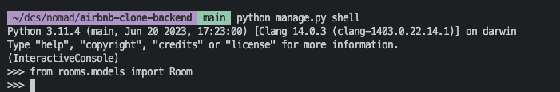
3. `Room.objects` 를 사용하면 Room 오브젝트에 접근할 수 있습니다.

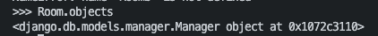

예시 : 
1. `room = Room.object(name="Beautiful House in 서울")`
2. `room.price = 20`
3. `room.save()` 를 하면 20 가격으로 정해진다. 

자주쓰는 메서드
- `.all()` 
- `.filter()`조건을 갖춘 데이터들을 찾을 때 사용
- `.get()` 조건을 갖춘 하나의 데이터를 찾을 때 사용(한가지만 리턴하도록 조건을 잘 정해야 함)
- `.create()`
- `.exclude()` 조건을 제외함 
- `.count()` 갯수를 셈


### query set

> `Room.objects.all()` 호출 시 단순히 배열이 아닌 <QuerySet > 를 리턴 받는데, query set은 연산자를 함꼐 묶어주는 일을 한다. 

`Room.objects.filter(pet_friendly=True).exclude(price__lt=15)`

> 메서드를 정의하는 방법도 있습니다.

rooms/admin.py
```py
from django.contrib import admin
from .models import Room, Amenity

@admin.register(Room)
class RoomAdmin(admin.ModelAdmin):
    list_display = (
        ...
    )

    list_filter = (
        ...
    )

    def total_amenities(self, room):
        return room.amenities.count()
```

rooms/models.py 에 정의할 경우
```py
class Room(CommonModel):
    ...
    def total_amenities(self):
        return self.amenities.count()
```

### foreign key 로 필터링 하기
#### reverse accessor 

> 문제: Room 모델은 어떤 owner 가 방을 소유했는지를 가르키는 Foreign key 를 가지고 있다고 합시다. 그러면 특정 owner 가 어떤 방들을 가지고 있는지, 몇개를 갖고있는 지에 대한 정보를 알려면 어떻게 해야 할까요?

- 방법1 : `Room.objects.filter(owner__username='hwisaac')` : 해당 username 에 해당하는 모든 Room 들을 반환합니다.
- 방법2 : (reverse accessor) 

```py
me = User.objects.get(pk=1)
me.rooms # 에러
me.room_set.all() # 작동
```
- foreign 키를 연결할 때마다 연결당한 해당 모델은 _set 에 해당하는 속성이 생깁니다.


> 접근자를 커스터마이징 해봅시다! <related name>
> `user.room_set.all()` 대신 `category.rooms.all()` 으로 접근하는 방법은?

rooms/models.py
```py
class Room(CommonModel):
     owner = models.ForeignKey(
        "users.User",
        on_delete=models.CASCADE,
        related_name='rooms', # 👈추가
    )
```
이렇게하면 `user.room_set` 대신에 `user.rooms` 로 접근할 수 있습니다.


<hr />

# django 의 최적화
```py
# 모든 데이터를 불러오기 때문에 성능상 좋지 않음
for review in room.reviews.all():
    ...

# 좀더 구체적인 쿼리요청으로 필요한 데이터만 가져와서 성능을 개선
for review_rating in room.reviews.all().values("rating"):
    ...
```

# Power Admin

1. action 커스텀하기
2. admin 패널의 `display_list` 커스텀하기 
3. 검색 기능 커스텀하기 (`search_fields`)

## action custom
rooms/admin.py
```py
@admin.action(description="가격 초기화하기")
def reset_prices(model_admin, request, queryset): # (action을 호출하는 class, 액션 호출에 대한 정보, 사용자가 선택한 객체들의 리스트)
    print(model_admin) # rooms.RoomAdmin
    print(dir(request)) # ['COOKIE', ...]
    print(queryset) # <QuerySet [<Room: Apt. in 서울>]>
    for room in rooms.all():
        room.price = 0
        room.save()

@admin.register(Room)
class RoomAdmin(admin.ModelAdmin):
    actions = ( reset_prices, )
    ...
```
<hr />

# URLs and Views

> 실제로 우리 프로젝트에서는 django 의 템플릿을 적용하진 않을 예정이다.

config/urls.py
```py
from django.contrib import admin
from django.urls import path

urlpatterns = [
    path('admin/', admin.site.urls),
]
```
옵션1:
`urls.py` 파일에 직접 모든 url 추가하기

옵션2(분할정복):
생성한 각 app 마다 `urls.py` 파일을 생성해준 뒤, `config/urls.py` 파일에 추가하기

## views.py 

> view 는 유저가 특정 url 에 접근할 때 작동하는 함수입니다.


예시: 유저가 /rooms 로 접속한다.

rooms/views.py
```py
from django.shortcuts import render
from django.http import HttpResponse

# Create your views here.
def sayHello(request):
    return HttpResponse("hello")
```

config/urls.py
```py
from django.contrib import admin
from django.urls import path
from rooms import views as room_views

urlpatterns = [
    path('admin/', admin.site.urls),
    path("rooms", room_views.say_hello),
]
```

## 분할정복 해보기! (추천)

room/views.py
```py
from django.shortcuts import render
from django.http import HttpResponse

def sayHello(request):
    return HttpResponse("hello")

def see_one_room(request, room_id):
    return HttpResponse(f"see room with id : {room_id}")
```

room/urls.py
```py
from django.urls import path
from . import views

urlpatterns = [
    path("", views.say_hello),
    path("<int:room_id>", views.see_one_room)
]
```

config/urls.py
```py
from django.contrib import admin
from django.urls import path

urlpatterns = [
    path('admin/', admin.site.urls),
    path('rooms/', include('rooms.urls')),
]

```

> 현재 트랜드에서 django 의 쓰임새

- UI 는 리액트에 맡깁니다.
- admin 패널 제작
- ORM 사용
- FE 에 JSON 제공하기 
- GraphQL 쿼리에 응답하기


<hr />

# Django REST Framework

> Django REST framework 는 쟝고로 API 만드는 걸 아주 쉽게 만들어주는 패키지입니다.

## 설치

- `poetry shell`
- `poetry add djangorestframework`
- `config/settings.py` 에 INSTALLED_APPS 에 `"rest_framework"` 추가

config/settings.py
```py
THIRD_PARTY_APPS = [
    "rest_framework",
]

INSTALLED_APPS = SYSTEM_APPS + CUSTOM_APPS + THIRD_PARTY_APPS
```

## REST framework 를 사용하지 않는 경우

- GET POST /categories
- GET /categories/1

> /categories 로 접속하면 categories.urls 로 간다:

config/urls.py
```py
from django.contrib import admin
from django.urls import path, include

urlpatterns = [
    path('admin/', admin.site.urls),
    path('categories/', include("categories.urls")),
]
```

categories/urls.py
```py
from django.urls import path
from . import views

urlpatterns = [
    path('categories/', views.categories),
]
```

categories/views.py
```py
from django.http import JsonResponse
from .models import Category

def categories(request):
    all_categories = Category.objects.all()
    
    return JsonResponse({"ok": True})
```

## REST Framework 를 사용한 경우

- `@api_view()` 데코레이터를 적용
- `rest_framework.response` 의 `Response` 로 응답하기
- `serializers.py` 모듈에 serializer 를 작성하기

categories/serializers.py
```py
from rest_framework import serializers

# name 과 kind 등이 JSON 으로 어떻게 표현하는지 설명
class CategorySerializer(serializers.Serializer):
    pk = serializers.IntegerField()
    name = serializers.CharField(required=True)
    kind = serializers.CharField()
    created_at = serializers.DateTimeField()
```

categories/views.py
```py
from rest_framework.decorators import api_view
from rest_framework.response import Response
from .models import Category

@api_view()
def category(request, pk):
    category = Category.objects.get(pk=pk)
    serializer = CategorySerializer(category)
    return Response(serializer.data)
```

`/categories` 접속
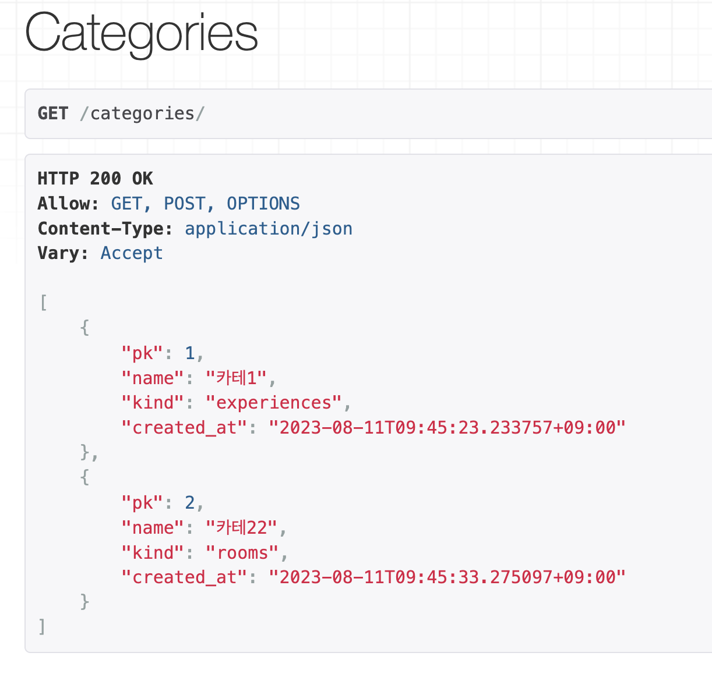

## Post request

- `POST` 메서드로 요청을 받을 수 있습니다.
- `serializer` 는 파이썬 데이터를 JSON 으로 번역하기도 하면서, 반대로 JSON 을 파이썬 데이터로 변환해주는 역할도 합니다.

```py
from .serializers import CategorySerializer

@api_view(["GET", "POST"])
def categories(request):
    if request.method == "GET":
        all_categories = Category.objects.all()
        serializer = CategorySerializer(all_categories, many=True)
        return Response(serializer.data)
    elif request.method == "POST":
        # 주의: POST 요청을 받을 때 서버는 해당 데이터가 model 에 적합한지 항상 데이터를 검증해야 합니다!
        serializer = CategorySerializer(data=request.data)
        if serializer.is_valid(): # serializer 는 데이터 검증도 도와줍니다
            return Response({"created": True})
        else:
            return Response(serializer.errors)
```

categories/serializers.py
```py
from rest_framework import serializers

class CategorySerializer(serializers.Serializer):
    # read_only=True 면 필수로 넣지 않아도 됩니다.
    pk = serializers.IntegerField(read_only=True)
    name = serializers.CharField(
        # 검증할 조건
        required=True,
        max_length=50, 
    )
    kind = serializers.CharField(
        max_length=15,
    )
    created_at = serializers.DateTimeField(read_only=True)
```


## `serializer.save()` Post 데이터를 db 에 저장하기

> `serializer.save()` 가 호출되면 `create` 메서드를 찾아서 실행합니다.
> `create` 메서드는 (에러 혹은) 객체를 리턴해야 합니다.


categories/views.py
```py
@api_view(["GET", "POST"])
def categories(request):
    ... 
    if request.method == "POST":
        serializer = CategorySerializer(data=request.data)
        if serializer.is_valid():
            new_category = serializer.save()
            return Response(
                CategorySerializer(new_category).data,
            )
        else:
            return Response(serializer.errors)
```

categories/views.py
```py
from rest_framework import serializers
from .models import Category

# name 과 kind 가 JSON 으로 어떻게 표현하는지 설명
class CategorySerializer(serializers.Serializer):
    pk = serializers.IntegerField(read_only=True)
    name = serializers.CharField(
        required=True,
        max_length=50,
    )
    kind = serializers.ChoiceField(
        choices=Category.CategoryKindChoices.choices,
    )
    created_at = serializers.DateTimeField(read_only=True)
    
    def create(self, validated_data):
        return Category.objects.create(**validated_data)
```

- `**validated_data` 는 다음과 같은 역할을 수행합니다

```py
validated_data = {'name' : 'Category', 'kind': 'rooms'}

**validated_data = {
    name = 'Category'
    kind = 'rooms'
}
```

## `update()` PUT 데이터를 db 에 업데이트하기

- `serializers` 에 `update` 메서드를 추가합니다.
- `PUT` 메서드를 등록합니다

categories/serializers.py
```py
from rest_framework import serializers
from .models import Category

# name 과 kind 가 JSON 으로 어떻게 표현하는지 설명
class CategorySerializer(serializers.Serializer):
    ... 
    def update(self, instance, validated_data):
        instance.name = validated_data.get("name", instance.name)
        instance.kind = validated_data.get("kind", instance.kind)
        instance.save()
        return instance

```

categories/views.py
```py
@api_view(["GET", "PUT"])
def category(request, pk):
    if request.method == "PUT":
        serializer = CategorySerializer(
            category, # 업데이트하려는 category를 db 에서 가져와야 한다(그래야 update실행. instance 에 category를 넣어줌)
            data=request.data, # 사용자로부터 받은 데이터로 serializer 만든다
            partial=True, # 입력데이터가 완벽한 형태가 아닐 수 있음. 부분적인 데이터도 허용
        )
        if serializer.is_valid():
            # 여기 .save() 는 create 가 아닌 update 메서드를 호출합니다.
            updated_category = serializer.save()
            return Response(CategorySerializer(updated_category).data)
        else:
            return Response(serializer.errors)
```
## DoesNotExist 에러 처리하기
```py
from rest_framework.exceptions import NotFound

@api_view(["GET", "PUT"])
def category(request, pk):
    try:
        category = Category.objects.get(pk=pk)
    except Category.DoesNotExist:
        raise NotFound
    
    # ...
```

NotFound 화면

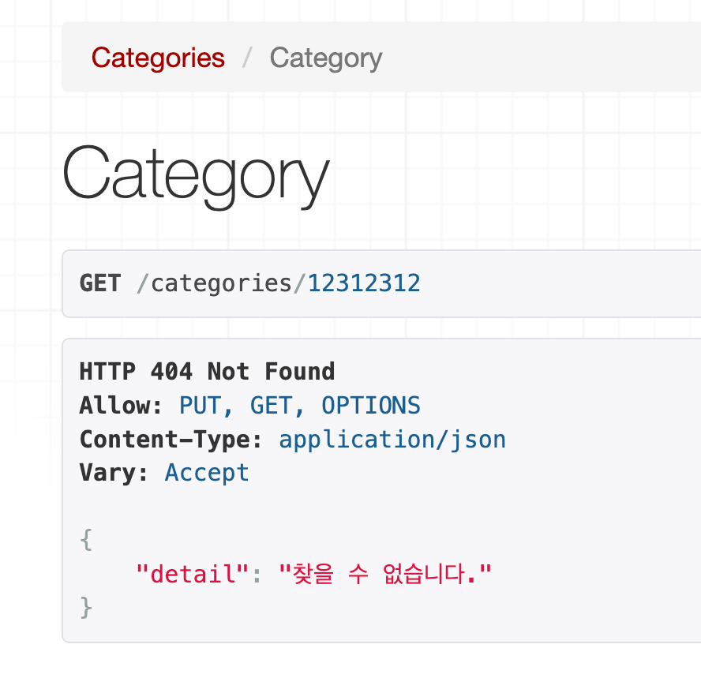

## DELETE : db 에서 삭제하기

- views 에서 DELETE 메서드 추가

categories/views.py
```py
@api_view(["GET", "PUT", "DELETE"])
def category(request, pk):
    ...
    elif request.method == "DELETE":
        category.delete()
        return Response(status=HTTP_204_NO_CONTENT)
```

`/categories/1` 로 접속하면 `DELETE` 버튼이 추가되어 있습니다.

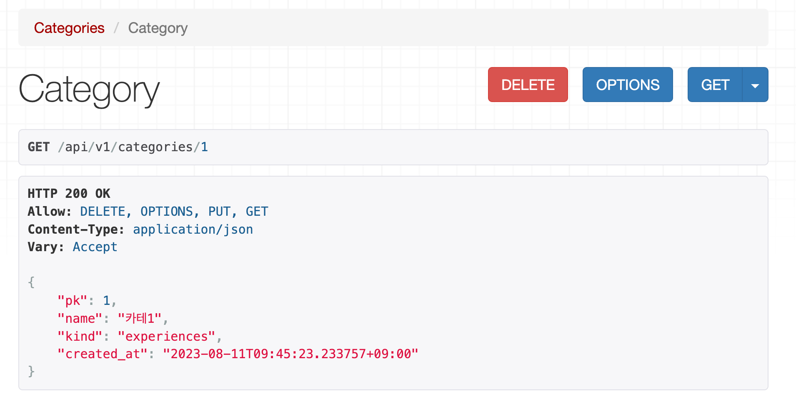

## API Views
> 지금까지 적용한 코드보다 훨씬 간결하고 깔끔하게 API 를 구성할 수 있습니다!

- `APIView` 를 상속하는 클래스를 만듭니다.
- `get`, `post` 등의 메서드를 정의합니다.

categories/views.py
```py
from rest_framework.views import APIView
```

```py
# 변경전
@api_view(["GET", "POST"])
def categories(request):
    if request.method == "GET":
        all_categories = Category.objects.all()
        serializer = CategorySerializer(all_categories, many=True)
        return Response(serializer.data)
    elif request.method == "POST":
        serializer = CategorySerializer(data=request.data)
        if serializer.is_valid():
            new_category = serializer.save()
            return Response(
                CategorySerializer(new_category).data,
            )
        else:
            return Response(serializer.errors)

# 변경후
class Categories(APIView):
    def get(self, request):
        all_categories = Category.objects.all()
        serializer = CategorySerializer(all_categories, many=True)
        return Response(serializer.data)

    def post(self, request):
        serializer = CategorySerializer(data=request.data)
        if serializer.is_valid():
            new_category = serializer.save()
            return Response(
                CategorySerializer(new_category).data,
            )
        else:
            return Response(serializer.errors)
```

- get_object 는 REST framework 의 컨벤션을 따르는 메서드입니다.
- 상세 정보를 가져올때는 `get_object`로 우선 가져오고 `get`/`put`/`delete` method 등에 공유합니다

`categories/views.py`
```py
# 변경전
@api_view(["GET", "PUT", "DELETE"])
def category(request, pk):
    try:
        category = Category.objects.get(pk=pk)
    except Category.DoesNotExist:
        raise NotFound

    if request.method == "GET":
        serializer = CategorySerializer(category)
        return Response(serializer.data)
    elif request.method == "PUT":
        serializer = CategorySerializer(
            category,
            data=request.data,
            partial=True,
        )
        if serializer.is_valid():
            updated_category = serializer.save()
            return Response(CategorySerializer(updated_category).data)
        else:
            return Response(serializer.errors)
    elif request.method == "DELETE":
        category.delete()
        return Response(status=HTTP_204_NO_CONTENT)

# 변경후 
class CategoryDetail(APIView):
    # get_object 는 REST framework 의 컨벤션을 따르는 메서드입니다.
    # 상세 정보를 가져올때는 get_object로 우선 가져오고 get/put/delete method 등에 공유합니다
    def get_object(self, pk):
        try:
            return Category.objects.get(pk=pk)
        except Category.DoesNotExist:
            raise NotFound

    def get(self, request, pk):
        serializer = CategorySerializer(self.get_object(pk))
        return Response(serializer.data)

    def put(self, request, pk):
        serializer = CategorySerializer(
            self.get_object(pk),
            data=request.data,
            partial=True,
        )
        if serializer.is_valid():
            updated_category = serializer.save()
            return Response(CategorySerializer(updated_category).data)
        else:
            return Response(serializer.errors)

    def delete(self, request, pk):
        self.get_object(pk).delete()
        return Response(status=HTTP_204_NO_CONTENT)
```

categories/urls.py
```py
# 변경전
urlpatterns = [
    path('', views.categories),
    path("<int:pk>", views.category),
]
# 변경후 
urlpatterns = [
    path("", views.Categories.as_view()),
    path("<int:pk>", views.CategoryDetail.as_view()),
]
```
<hr />

## ModelSerializer : Serializer 의 코드 단순화

> Django 에 Model 을 이미 설명했기 때문에, 해당 모델을 활용해서 serializer 에 적용할 수 있습니다. 

- `ModelSerializer` 는 정의해둔 `model`을 바탕으로 필드(`fields`/`exclude` 속성)를 가져와 주고 여러 가지 기능을 제공해줍니다.
- 또한, 자동으로 `create`, `update` 메소드를 만들어주기 때문에 직접 정의하지 않아도 됩니다.

categories/serializers.py
```py
from rest_framework import serializers
from .models import Category

class CategorySerializer(serializers.ModelSerializer):
    class Meta:
        model = Category # category 모델을 위한 serializer를 생성합니다.
        fields = "__all__" # 어떤 field를 가져올지 선택합니다.
```

categories/views.py
```py
# 변경전
class Categories(APIView):
    def get(self, request):
        all_categories = Category.objects.all()
        serializer = CategorySerializer(all_categories, many=True)
        ...

# 변경후
class Categories(APIView):
    def get(self, request):
        all_categories = Category.objects.all()
        serializer = CategorySerializer(
            all_categories,
            many=True,
        )
        ...

```

## `ModelViewSet` 으로 views.py 를 개선하기

> 너무 많은 추상화, 너무 많은 코드가 숨겨지므로 모호해집니다. 더 명확하게 코드를 작성하는 것이 더 나을 수 있습니다.(API View 를 작성하는게 낫습니다)

https://www.django-rest-framework.org/api-guide/viewsets/

- `ModelViewSet` 을 상속하는 클래스를 만듭니다. 
  - `CategorySerializer` 를 알려줍니다.
  - `queryset` 에 category 객체를 넣어줍니다.
- `urls.py` 에서 http 메소드 마다 작동할 class 메소드를 연결해줍니다.

categories/views.py
```py
from rest_framework.viewsets import ModelViewSet
from .models import Category
from .serializers import CategorySerializer

class CategoryViewSet(ModelViewSet):
    serializer_class = CategorySerializer
    queryset = Category.objects.all()
```


categories/urls.py
```py
urlpatterns = [
    path(
        "",
        views.CategoryViewSet.as_view(
            {
                "get": "list", # get 요청이 오면 list라는 메소드의 코드 실행
                "post": "create", # post 요청이오면 create메소드 실행
            }
        ),
    ),
    path(
        "<int:pk>",
        views.CategoryViewSet.as_view(
            {
                "get": "retrieve",
                "put": "partial_update",
                "delete": "destroy",
            }
        ),
    ),
]
```

## router

https://www.django-rest-framework.org/api-guide/routers/

> router 를 사용하면 


# REST API

## `Rooms`: serializer 간에 relation 을 어떻게 만드는가

- room 을 수정하고 싶을 때 관계가 어떤지, 권한을 고려해야 합니다. 

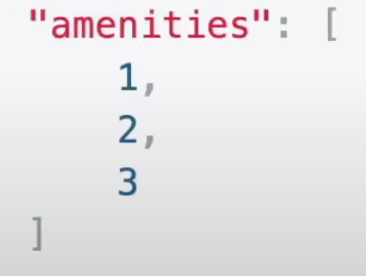
이와 같은 데이터보다 
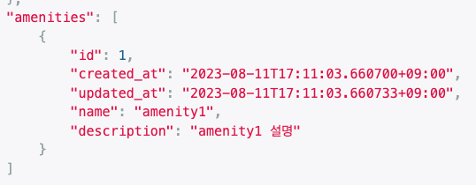
이러한 데이터가 있는 것이 더 좋을 것입니다.

> `serializer` 에서 `depth` 값을 넣어주면 됩니다!

rooms/serializers.py
```py
from rest_framework.serializers import ModelSerializer
from .models import Amenity, Room


class RoomSerializer(ModelSerializer):
    class Meta:
        model = Room
        fields = "__all__"
        depth = 1 # id 대신에 데이터를 넣어줌


class AmenitySerializer(ModelSerializer):
    class Meta:
        model = Amenity
        fields = "__all__"
```

rooms/urls.py
```py
from django.urls import path
from . import views

urlpatterns = [
    path("", views.Rooms.as_view()),
    path("amenities/", views.Amenities.as_view()),
    path("amenities/<int:pk>", views.AmenityDetail.as_view()),
]
```

rooms/views.py
```py
from rest_framework.views import APIView
from rest_framework.status import HTTP_204_NO_CONTENT
from rest_framework.response import Response
from rest_framework.exceptions import NotFound
from .models import Amenity, Room
from .serializers import AmenitySerializer, RoomSerializer

... 

class Rooms(APIView):
    def get(self, request):
        all_rooms = Room.objects.all()
        serializer = RoomSerializer(all_rooms, many=True)
        return Response(serializer.data)
```

## serializer 수정해서 필요한 정보만 주도록 커스텀하기

> 만약 rooms 의 전체 데이터를 요청할 때 너무 많은 데이터를 넘겨줘야 하면 db 에 부담이 될 수 있습니다. 필요한 정보만 주는 것이 좋습니다.

- serializers 에서 `fields="__all__` 대신 필요한 필드만 선택합니다.

users/serializers.py
```py
from rest_framework.serializers import ModelSerializer
from .models import User

# 조금 보여줄 유저정보
class TinyUserSerializer(ModelSerializer):
    class Meta:
        model = User
        fields = (
            "name",
            "avatar",
            "username",
        )
```

rooms/serializers.py
```py
from users.serializers import TinyUserSerializer
from categories.serializers import CategorySerializer

class AmenitySerializer(ModelSerializer):
    class Meta:
        model = Amenity
        fields = (
            "name",
            "description",
        )

# depth
class RoomDetailSerializer(ModelSerializer):
    # '읽기전용'은 room 데이터를 수정하지 못하게하므로, 해당 필드에 대한 정보를 PUT/POST 요청으로 요구하진 않습니다.

    owner = TinyUserSerializer(read_only=True) # owner 를 가져올때 TinyUserSerializer 를 이용하라. 
    amenities = AmenitySerializer(
        read_only=True,
        many=True,
    )
    category = CategorySerializer(
        read_only=True,
    )

    class Meta:
        model = Room
        fields = "__all__"

class RoomListSerializer(ModelSerializer):
    class Meta:
        model = Room
        fields = (
            "pk",
            "name",
            "country",
            "city",
            "price",
        )

```
rooms/views.py
```py
from .serializers import AmenitySerializer, RoomListSerializer, RoomDetailSerializer

class RoomDetail(APIView):
    def get_object(self, pk):
        try:
            return Room.objects.get(pk=pk)
        except Room.DoesNotExist:
            raise NotFound

    def get(self, request, pk):
        room = self.get_object(pk)
        serializer = RoomDetailSerializer(room)
        return Response(serializer.data)
```

`api/v1/rooms/1` 으로 디테일 정보 출력한 내용
```json
HTTP 200 OK
Allow: GET, HEAD, OPTIONS
Content-Type: application/json
Vary: Accept

{
    "id": 1,
    "owner": {
        "name": "",
        "avatar": null,
        "username": "user1"
    },
    "amenities": [
        {
            "name": "amenity1",
            "description": "amenity1 설명"
        }
    ],
    "category": {
        "name": "카테1",
        "kind": "experiences"
    },
    "created_at": "2023-08-11T17:11:18.750463+09:00",
    "updated_at": "2023-08-11T17:11:18.750490+09:00",
    "name": "룸1",
    "country": "한국",
    "city": "서울",
    "price": 4,
    "rooms": 3,
    "toilets": 2,
    "description": "첫번째 룸입니다",
    "address": "서울",
    "pet_friendly": true,
    "kind": "entire_place"
}
```

## 에러: create() method does not support writable nested fields by default.

> many-to-many 필드나, foreign key 에 해당하는 필드에 관한 정보도 함께 POST 하더라도, 해당 데이터들은 DB 에 저장이 될 수 없기 때문에 나오는 에러입니다. 어떻게 relationship 을 정해줄 수 있을까요?

- 해당 필드를 `read_only=True` 
- `.save()` 메서드가 호출될 때, `owner=request.user` 의 정보를 같이 넘겨줍니다.

> 원리: user 데이터로 생성된 serializer가 `serializer.save(owner=request.user)` 메서드를 호출하면 rooms/serializers.py 의 create 메서드를 호출하게 됩니다. 이 create 의 `validated_data` 에 `owner` 정보를 추가하여 전달하게 되고, 이 정보를 포함한 데이터를 생성하게 되므로 relation 이 정의가 됩니다.

```py
    # APIView 를 사용하면 create 메소드는 일부 정의하지 않아도 됨
    def create(self, validated_data):
        # owner 의 정보가 validated_data 에 담겨서 전달됩니다.
        return Room.objects.create(**validated_data)
```

rooms/views.py
```py
from rest_framework.exceptions import NotFound, NotAuthenticated

class Rooms(APIView):
    def get(self, request):
        all_rooms = Room.objects.all()
        serializer = RoomListSerializer(all_rooms, many=True)
        return Response(serializer.data)

    def post(self, request):
        if request.user.is_authenticated:
            serializer = RoomDetailSerializer(data=request.data)
            if serializer.is_valid():
                room = serializer.save(owner=request.user)
                serializer = RoomDetailSerializer(room)
                return Response(serializer.data)
            else:
                return Response(serializer.errors)
        else:
            raise NotAuthenticated
```
### 테스트
POST /api/v1/rooms/
```json
{
    "price":321,
    "rooms" : 1,
    "toilets": 2,
    "description": "test",
    "address" : "테스트주소",
    "kind" : "private_room"
}
```

응답
```json
HTTP 200 OK
Allow: GET, POST, HEAD, OPTIONS
Content-Type: application/json
Vary: Accept

{
    "id": 2,
    "owner": {
        "name": "",
        "avatar": null,
        "username": "hwisaac"
    },
    "amenities": [],
    "category": null,
    "created_at": "2023-08-12T13:48:40.676111+09:00",
    "updated_at": "2023-08-12T13:48:40.676164+09:00",
    "name": "",
    "country": "한국",
    "city": "서울",
    "price": 321,
    "rooms": 1,
    "toilets": 2,
    "description": "test",
    "address": "테스트주소",
    "pet_friendly": true,
    "kind": "private_room"
}
```


> `owner` 가 잘 인식되고 있는 것을 알수있습니다. 
> `"category" : 2` `"amenity": [1,2,3]` 에 해당 하는 정보도 같이 POST 해서 연결하려면 어떻게 해야 할까요?

### room 생성시 category 에 대한 입력을 받아서 relation 주기

Goal:
1. 사용자가 category 넘버를 POST 하면, 해당하는 아이디를 가진 카테고리를 찾는다.
2. 해당 카테고리와 생성된 방을 연결시킨다.


- 단순히 `"category" : 2` 를 POST 하면 request.data 에는 담겨 있지만, validated_data 에는 담겨있지 않습니다. -> serializer.save() 에 category 를 담아줘야 합니다.

rooms/views.py
```py
class Rooms(APIView):
    def post(self, request):
        if request.user.is_authenticated:
            serializer = RoomDetailSerializer(data=request.data)
            if serializer.is_valid():
                # category : 1 데이터를 category_pk 에 담아줍니다.
                category_pk = request.data.get("category")
                if not category_pk:
                    raise ParseError # 400 Bad Request
                try:
                    category = Category.objects.get(pk=category_pk)
                    if category.kind == Category.CategoryKindChoices.EXPERIENCES: # 카테고리가 experience 인지 room 인지 체크
                        raise ParseError # 400 Bad Request
                except Category.DoesNotExist:
                    raise ParseError
                room = serializer.save(
                    owner=request.user,
                    category=category,
                )
                serializer = RoomDetailSerializer(room)
                return Response(serializer.data)
            else:
                return Response(serializer.errors)
        else:
            raise NotAuthenticated
```

POST /api/v1/rooms/
```json
{
    "name": "House created with DRF",
    "country": "한국",
    "city": "서울",
    "price":321,
    "rooms" : 1,
    "toilets": 2,
    "description": "test",
    "address" : "테스트주소",
    "pet_friendly" : true,
    "kind" : "private_room",
    "category" : 2
}
```

응답
```json
HTTP 200 OK
Allow: GET, POST, HEAD, OPTIONS
Content-Type: application/json
Vary: Accept

{
    "id": 3,
    "owner": {
        "name": "",
        "avatar": null,
        "username": "hwisaac"
    },
    "amenities": [],
    "category": {
        "name": "카테22",
        "kind": "rooms"
    },
    "created_at": "2023-08-12T14:26:34.825987+09:00",
    "updated_at": "2023-08-12T14:26:34.826010+09:00",
    "name": "House created with DRF",
    "country": "한국",
    "city": "서울",
    "price": 321,
    "rooms": 1,
    "toilets": 2,
    "description": "test",
    "address": "테스트주소",
    "pet_friendly": true,
    "kind": "private_room"
}
```

### room 생성시 amenities 배열에 대한 입력을 받아서 relation 주기


<hr />

# Users API

<hr />

# Graphql API

<hr />

# Authentication

<hr />

# API Testing